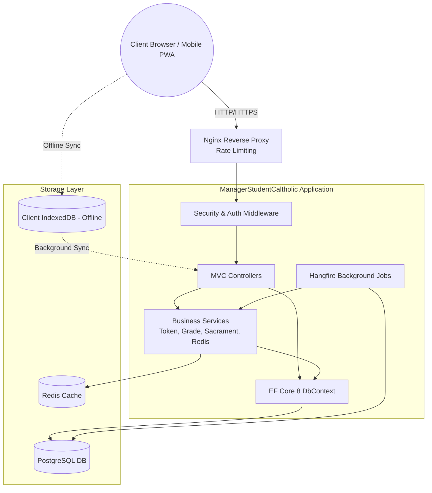

```mermaid
	graph TD
    Client((Client Browser / Mobile PWA))
    Nginx[Nginx Reverse Proxy\nRate Limiting]
    
    subgraph ManagerStudentCaltholic Application
        Auth[Security & Auth Middleware]
        Controllers[MVC Controllers]
        Services[Business Services\nToken, Grade, Sacrament, Redis]
        EFCore[EF Core 8 DbContext]
        Jobs[Hangfire Background Jobs]
    end
    
    subgraph Storage Layer
        PostgreSQL[(PostgreSQL DB)]
        Redis[(Redis Cache)]
        IndexedDB[(Client IndexedDB - Offline)]
    end
    
    Client -- HTTP/HTTPS --> Nginx
    Nginx --> Auth
    Auth --> Controllers
    Client -. Offline Sync .-> IndexedDB
    IndexedDB -. Background Sync .-> Controllers
    
    Controllers --> Services
    Controllers --> EFCore
    
    Services --> Redis
    Services --> EFCore
    
    EFCore --> PostgreSQL
    Jobs --> Services
    Jobs --> PostgreSQL

```