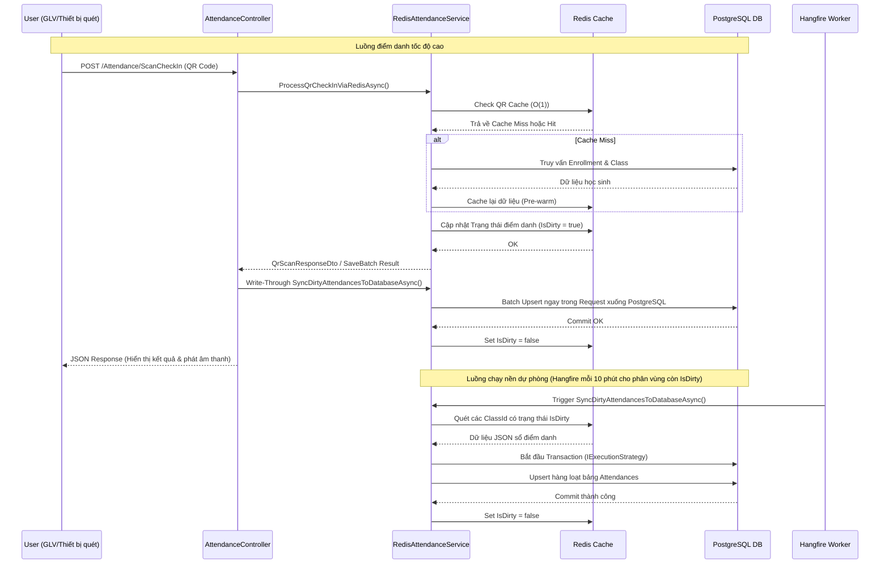

```mermaid
sequenceDiagram
    participant User as User (GLV/Thiết bị quét)
    participant Ctrl as AttendanceController
    participant R_Svc as RedisAttendanceService
    participant Redis as Redis Cache
    participant DB as PostgreSQL DB
    participant Hangfire as Hangfire Worker

    Note over User, DB: Luồng điểm danh tốc độ cao
    User->>Ctrl: POST /Attendance/ScanCheckIn (QR Code)
    Ctrl->>R_Svc: ProcessQrCheckInViaRedisAsync()
    R_Svc->>Redis: Check QR Cache (O(1))
    Redis-->>R_Svc: Trả về Cache Miss hoặc Hit
    alt Cache Miss
        R_Svc->>DB: Truy vấn Enrollment & Class
        DB-->>R_Svc: Dữ liệu học sinh
        R_Svc->>Redis: Cache lại dữ liệu (Pre-warm)
    end
    R_Svc->>Redis: Cập nhật Trạng thái điểm danh (IsDirty = true)
    Redis-->>R_Svc: OK
    R_Svc-->>Ctrl: QrScanResponseDto / SaveBatch Result
    Ctrl->>R_Svc: Write-Through SyncDirtyAttendancesToDatabaseAsync()
    R_Svc->>DB: Batch Upsert ngay trong Request xuống PostgreSQL
    DB-->>R_Svc: Commit OK
    R_Svc->>Redis: Set IsDirty = false
    Ctrl-->>User: JSON Response (Hiển thị kết quả & phát âm thanh)

    Note over R_Svc, DB: Luồng chạy nền dự phòng (Hangfire mỗi 10 phút cho phân vùng còn IsDirty)
    Hangfire->>R_Svc: Trigger SyncDirtyAttendancesToDatabaseAsync()
    R_Svc->>Redis: Quét các ClassId có trạng thái IsDirty
    Redis-->>R_Svc: Dữ liệu JSON sổ điểm danh
    R_Svc->>DB: Bắt đầu Transaction (IExecutionStrategy)
    R_Svc->>DB: Upsert hàng loạt bảng Attendances
    DB-->>R_Svc: Commit thành công
    R_Svc->>Redis: Set IsDirty = false
	
```